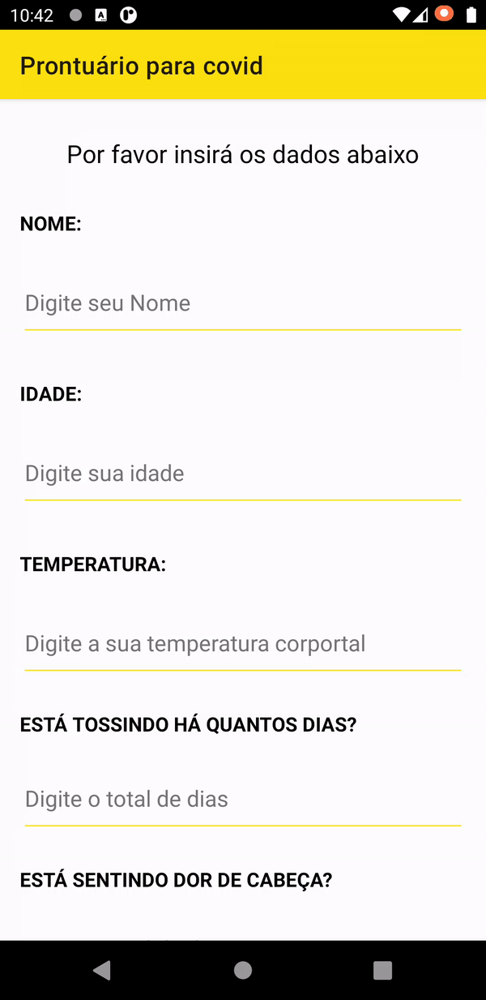

# Horizon Desafio

- Desafio para vaga de estágio de Android nativo

## Autores

- [@joaoquinto](https://github.com/joaoquinto)
- [Portfólio](https://joaoquinto.github.io/joaoquinto-portfolio/)

## Aprendizados

### O que você aprendeu construindo esse projeto?

- Como utilizar o Android Studio
- Como fazer layouts simples com xml
- Constraint layout

### Quais desafios você enfrentou?

- Não saber Android Nativo
- Não saber Java

### Como você superou-os?

- Estudando
- Pesquisando

## Screenshots

